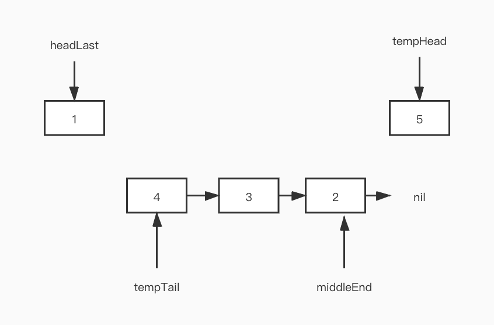

# 92. 反转链表 II

## 1. 题目

反转从位置 m 到 n 的链表。请使用一趟扫描完成反转。

说明:
1 ≤ m ≤ n ≤ 链表长度。

示例:
```
输入: 1->2->3->4->5->NULL, m = 2, n = 4
输出: 1->4->3->2->5->NULL
```

## 2. 解题思路

该题的难点有两个：

1. 翻转头节点的特殊处理，例如m=0,n=3，那么返回链表的头节点就与原链表不同，需要特殊处理
2. m-n这一部分节点的完全反转。

解决第一个问题的思路如下：

链表的传统实现方式都需要借助一个哑节点，即链表头的那个占位节点。该节点的作用就是将头节点变为非头节点，然后进行统一处理。此处同理，仍可以采用相同的方式进行处理。

我们可以创建一个哑节点，然后将输入的链表连接在头节点之后，如此，就可以不考虑头节点的特殊性了。

解决第二个问题的思路如下：

如果要完全反转 m-n这部分的节点，相对简单的方式是使用堆栈或者递归。但是这会提高算法的空间复杂度，如果想要使用O(1)的空间复杂度处理就需要在原链表的基础上进行处理。可以采用如下的处理方式：

以上面的例子为例：


在处理该链表的第2到第4个节点时，可以采用如下方式：

1. 遍历到2个节点的前一个节点，将其记录为headLast节点，该节点用于表示反转链表的前一个节点，并将第一个需要处理的节点声明为middleHead，用于表示第一个需要处理的节点。
    
    tempTail表示反转链表的尾节点，尾节点最后为null，因此tempTail为nil。将第一个需要处理的节点标记为middleEnd，因为他是反转链表的尾节点，由于处理过程中TempHead会更新，所以需要记录下来指针。
    
2. 从第2个节点开始遍历，向后遍历（4-2）次，每次遍历执行如下操作：
    1. 将tempHead记为temp，当前节点的下一节点标记为tempHead。
        
    2. 将temp节点置为tempTail的前一个节点
        
    3. 将tempTail指向temp
        
        
3. 遍历完成后结果如下：
     
4. 最后将headLast的下一个节点指向tempTail，middleEnd的下一个节点指向tempHead。
    